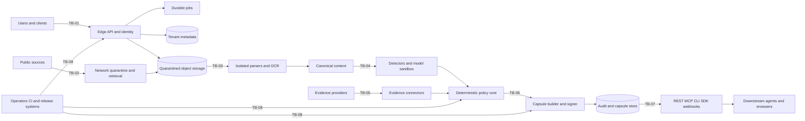

<!-- markdownlint-disable MD013 -->

# Verus Threat Model

Status: Approved baseline  
Version: 1.0  
Owners: Detection and security maintainers  
Review triggers: trust-boundary change, new input type, new provider, new public interface, security
incident, or General Availability review

## 1. Security objective

Verus prevents untrusted financial content from silently gaining instructional authority over a
downstream trading or research agent. It also protects the confidentiality, integrity, availability,
and tenant isolation of the service that performs that work.

The primary safety property is:

> A downstream agent receives only fields permitted by a deterministic, versioned policy, derived
> from traceable input and evidence, in a signed Context Capsule whose integrity can be
> independently verified.

Verus is a defense-in-depth component. It does not guarantee that accepted financial claims are
true, prevent every novel semantic attack, secure a compromised downstream host, or replace exchange
permissions and execution controls.

## 2. Scope

### In scope

- hosted and self-hosted Verus deployments;
- URLs, text, feeds, uploads, PDFs, office documents, images, and OCR;
- SEC, issuer investor-relations, Bitget, and future evidence connectors;
- deterministic and model-assisted detection;
- claim extraction, verification, and temporal evidence handling;
- policies, review workflows, Context Capsules, and signing keys;
- REST, MCP, CLI, SDK, webhook, model-provider, and Bitget integrations;
- user sessions, workspaces, service accounts, API keys, and RBAC;
- relational data, content-addressed evidence, queues, caches, and backups;
- the operator console, audit exports, telemetry, build, and release systems.

### Outside the security boundary

- downstream agent prompts, memory, tools, and hosts after they receive a valid capsule;
- the truthfulness of an otherwise authentic issuer or regulator publication;
- exchange execution systems and controls;
- user endpoints that are already compromised;
- laws, market suitability, profitability, or investment correctness;
- availability of the public internet and third-party sources.

These systems remain dependencies or residual risks and are addressed through least privilege,
integrity checks, explicit uncertainty, and operational controls where possible.

## 3. Assets

| ID     | Asset                                                                        | Required property                            |
| ------ | ---------------------------------------------------------------------------- | -------------------------------------------- |
| AST-01 | Verus system policy and non-overridable controls                             | Integrity and availability                   |
| AST-02 | Context Capsule contents and signatures                                      | Integrity, authenticity, and replay context  |
| AST-03 | Raw untrusted content and evidence snapshots                                 | Integrity, confidentiality, and isolation    |
| AST-04 | Source registry and trust metadata                                           | Integrity and traceability                   |
| AST-05 | Tenant users, roles, policies, scans, and portfolio context                  | Confidentiality and isolation                |
| AST-06 | API keys, sessions, provider secrets, exchange credentials, and signing keys | Confidentiality and controlled lifecycle     |
| AST-07 | Audit history and review decisions                                           | Integrity, attribution, and retention        |
| AST-08 | Queues, jobs, migrations, and scan state                                     | Integrity, availability, and idempotency     |
| AST-09 | Detector, prompt, model, schema, and component versions                      | Integrity and reproducibility                |
| AST-10 | Build pipeline, dependencies, images, packages, and release artifacts        | Integrity and provenance                     |
| AST-11 | Service capacity and third-party spend                                       | Availability and bounded cost                |
| AST-12 | Logs, traces, metrics, alerts, exports, and backups                          | Confidentiality, integrity, and availability |

## 4. Actors

| ID     | Actor                              | Capability and motivation                                                                         |
| ------ | ---------------------------------- | ------------------------------------------------------------------------------------------------- |
| ACT-01 | Malicious content author           | Places instructions, obfuscation, false facts, or exploit payloads in public content              |
| ACT-02 | Compromised or impersonated source | Controls a source, domain, redirect, certificate path, feed, or syndicated copy                   |
| ACT-03 | Unauthenticated network attacker   | Probes public interfaces, availability, parsing, retrieval, and credential handling               |
| ACT-04 | Malicious authenticated tenant     | Attempts cross-tenant access, resource abuse, policy weakening, or stored attacks                 |
| ACT-05 | Compromised account or service key | Uses legitimately issued access outside its intended purpose or lifetime                          |
| ACT-06 | Compromised provider or dependency | Returns malicious output, leaks data, changes behavior, or injects build/runtime code             |
| ACT-07 | Malicious or careless reviewer     | Releases unsafe content, bypasses process, or exposes quarantined material                        |
| ACT-08 | Privileged insider or operator     | Misuses administrative access, secrets, logs, policy, exports, or release systems                 |
| ACT-09 | Opportunistic cost attacker        | Triggers expensive fetches, parsers, OCR, models, storage, or deliveries                          |
| ACT-10 | Honest but mistaken user           | Misreads a verdict, uploads sensitive data, grants excessive permissions, or misconfigures policy |

No external content, source, user-controlled metadata, model response, webhook payload, or
integration response is trusted solely because it is authenticated.

## 5. Security invariants

The following invariants are release-blocking:

1. Raw untrusted content never becomes system instruction.
2. Content cannot grant itself network, tool, credential, policy, or execution authority.
3. Models cannot directly emit an `allow` decision or weaken deterministic policy.
4. Required checks that fail or do not complete resolve through explicit fail-closed policy.
5. A parser never receives content that bypassed registration and quarantine.
6. A tenant-owned object is accessed only with server-derived tenant scope.
7. Verus never requires Bitget trading, transfer, or withdrawal permission.
8. Raw hostile content is not rendered as active HTML in the console.
9. Every released capsule identifies its input, schema, policy, detector, evidence, and signing-key
   versions.
10. A signature proves artifact integrity and Verus provenance, not objective truth.
11. Historical verdicts and review decisions are append-only; policy changes do not rewrite them.
12. Secrets and raw hostile content do not enter default logs, traces, errors, analytics, or support
    exports.
13. Release artifacts are traceable to reviewed source and independently verifiable.

## 6. Trust boundaries and data flow

### TB-01: client to identity and edge

Untrusted requests cross authentication, authorization, validation, size, idempotency, quota, and
rate boundaries. Workspace scope is derived on the server, not accepted from an unverified object
reference.

### TB-02: public network to retrieval quarantine

URLs and network responses are hostile. Resolution, redirect, scheme, address, TLS, size, encoding,
decompression, timeout, and egress controls are applied at every hop. Retrieval has no access to
control-plane secrets or internal network destinations.

### TB-03: quarantined bytes to parsers and OCR

Parsers handle attacker-controlled formats and run with bounded CPU, memory, time, pages, recursion,
filesystem, process, and network capabilities. Parser failure cannot create an allowed result.

### TB-04: normalized content to detectors and models

Text may contain direct or indirect instructions. Model-assisted components receive no exchange,
policy, signing, administrative, or general network tools. Their structured output is validated and
treated as a signal, not authority.

### TB-05: evidence providers to connectors

Authentic transport does not guarantee truthful data. Connectors preserve source identity,
publication and retrieval time, version, citation, and contradiction state. Provider responses
remain untrusted input.

### TB-06: policy core to signer

Only a schema-valid policy result can request signing. The signer accepts a minimal canonical
artifact, verifies authorization and key state, and cannot be instructed by content or model text.

### TB-07: Verus artifacts to consumers

Consumers must verify schema support, signature, key status, disposition, freshness, tenant context,
and replay context. Raw content is excluded in strict mode and unavailable from default MCP tools.

### TB-08: operators, CI, and release systems

Privileged access is separated, least-privilege, short-lived where possible, reviewed, and audited.
Build and deployment identities are distinct from human accounts and application runtime identities.

### Cross-cutting tenant boundary

Tenant scope applies to relational queries, object keys, queues, caches, webhooks, exports,
telemetry attributes, support tools, and backups. A control at only the API route is insufficient.

## 7. Data classification

| Class                 | Examples                                                     | Default handling                                                                     |
| --------------------- | ------------------------------------------------------------ | ------------------------------------------------------------------------------------ |
| Public evidence       | Public filings and official announcements                    | Integrity protected; source and time retained                                        |
| Untrusted content     | Webpages, documents, feeds, OCR, metadata                    | Quarantined; inert; never logged or rendered active by default                       |
| Customer confidential | Portfolio mappings, scans, review comments, workspace policy | Tenant scoped; encrypted; retention controlled                                       |
| Credentials           | Sessions, API keys, provider keys, Bitget read-only keys     | Secret-managed; scoped; rotated; never recoverable in plaintext through product APIs |
| Signing material      | Active and retired private signing keys                      | Isolated key service; rotation and revocation audited                                |
| Security telemetry    | Findings, reason codes, component versions, safe error data  | Minimized; tenant scoped where applicable; integrity protected                       |
| Restricted evidence   | User uploads or licensed research                            | Explicit access and retention; excluded from public benchmark and support bundles    |

## 8. Threat register

### Ingestion and network threats

| ID          | Threat and affected assets                                                                                          | Preventive controls                                                                                                | Detection and response                                                        | Residual risk                                                                           |
| ----------- | ------------------------------------------------------------------------------------------------------------------- | ------------------------------------------------------------------------------------------------------------------ | ----------------------------------------------------------------------------- | --------------------------------------------------------------------------------------- |
| THR-ING-001 | Direct or indirect prompt injection gains instructional authority. AST-01, AST-02                                   | Instruction/data separation, strict schemas, deterministic policy, raw-content exclusion                           | Injection findings, attack corpus, policy block/review, regression alerts     | Novel semantic attacks may evade all detectors; downstream permissions remain necessary |
| THR-ING-002 | Hidden, encoded, fragmented, multilingual, or visual content evades inspection. AST-03, AST-09                      | Canonicalization, bounded decoding, DOM/metadata inspection, representation map                                    | Obfuscation findings, mutation tests, reviewer-safe diff                      | Perfect equivalence across every renderer and language is not possible                  |
| THR-ING-003 | Malformed file, archive, PDF, image, or decompression payload exploits or exhausts a parser. AST-03, AST-08, AST-11 | Type and size gates, quarantine, sandbox, resource limits, no parser network, patched minimal images               | Parser crash/resource metrics, dead-letter isolation, malicious fixture suite | Parser zero-days can remain; sandbox escape is a release-critical incident              |
| THR-NET-001 | URL causes SSRF, DNS rebinding, credential forwarding, or access to local/cloud metadata. AST-06, AST-10            | Scheme allowlist, canonical host/IP checks, DNS pinning, redirect revalidation, egress proxy, credential stripping | Block reason metrics, canary destinations, egress alerts                      | Public services that proxy private content require explicit adapters                    |
| THR-NET-002 | Redirect, mirror, TLS, canonical URL, or syndication behavior impersonates an authoritative source. AST-04          | Source registry, redirect-chain capture, domain and TLS checks, canonical-link policy                              | Source mismatch and identity state, registry audit                            | A genuinely compromised authoritative domain can still publish malicious data           |
| THR-NET-003 | Oversized, slow, recursive, or endless responses consume workers and cost. AST-08, AST-11                           | Byte, ratio, redirect, time, page, recursion, and concurrency budgets                                              | Quota, timeout, backlog, and cost alerts                                      | Distributed low-rate abuse may resemble legitimate load                                 |

### Evidence and model threats

| ID          | Threat and affected assets                                                                                      | Preventive controls                                                                                        | Detection and response                                           | Residual risk                                                                  |
| ----------- | --------------------------------------------------------------------------------------------------------------- | ---------------------------------------------------------------------------------------------------------- | ---------------------------------------------------------------- | ------------------------------------------------------------------------------ |
| THR-EVD-001 | False or manipulated claims appear credible because a source is authentic or popular. AST-02, AST-04            | Separate source identity from claim verification, typed claims, evidence quorum, primary-source preference | Unsupported/contradicted states and reviewer escalation          | Multiple sources can repeat the same false claim; Verus does not certify truth |
| THR-EVD-002 | Stale, corrected, amended, or time-shifted evidence is presented as current. AST-02, AST-04, AST-09             | Publication/retrieval/as-of times, source versions, amendments, freshness policy                           | Staleness and supersession findings, connector health alerts     | Sources can update without machine-visible version metadata                    |
| THR-EVD-003 | Entity, ticker, period, currency, unit, or event resolution binds evidence to the wrong subject. AST-02, AST-05 | Typed identifiers, ambiguity states, unit and period normalization, mapping confidence                     | Resolution conflicts and low-confidence review                   | Corporate changes and symbol reuse can remain ambiguous                        |
| THR-MOD-001 | Model is hijacked into calling tools, leaking prompts, changing policy, or marking content safe. AST-01, AST-06 | No tools or credentials, sandboxed provider adapter, constrained output, deterministic authority           | Invalid-output and policy-mismatch metrics, provider kill switch | Provider infrastructure or sandbox zero-days can expose submitted data         |
| THR-MOD-002 | External model provider retains or exposes confidential content. AST-03, AST-05                                 | Data minimization, provider configuration, consent, self-host option, restricted-data policy               | Provider audit, egress records, incident process                 | Provider contractual or technical failure cannot be fully controlled by Verus  |
| THR-MOD-003 | Model nondeterminism, update, outage, or rate limit changes results or blocks replay. AST-08, AST-09            | Record model/prompt/provider versions, bounded retry, deterministic fake, explicit unavailable state       | Drift tests, availability metrics, replay explanation            | Exact replay may be impossible for retired hosted models                       |

### Policy, review, and artifact threats

| ID          | Threat and affected assets                                                                                         | Preventive controls                                                                                                | Detection and response                                        | Residual risk                                                                           |
| ----------- | ------------------------------------------------------------------------------------------------------------------ | ------------------------------------------------------------------------------------------------------------------ | ------------------------------------------------------------- | --------------------------------------------------------------------------------------- |
| THR-POL-001 | Tenant or content weakens platform policy, bypasses a detector, or exploits precedence. AST-01                     | Pure versioned evaluator, non-overridable baseline, validated policy language, simulation and approval             | Policy diffs, audit, regression gates, rollback               | An approved but poorly designed policy can create false positives or unnecessary blocks |
| THR-POL-002 | Reviewer releases hostile content, colludes, or mistakes confidence for safety. AST-01, AST-02, AST-07             | Least privilege, inert preview, reason requirement, optional dual approval, no historical rewrite                  | Review metrics, anomalous approvals, periodic review          | Authorized humans can make incorrect judgments                                          |
| THR-ART-001 | Capsule, audit event, evidence package, or webhook is modified, substituted, or replayed. AST-02, AST-07, AST-12   | Canonical signing, digests, event IDs, tenant/audience binding, timestamps, nonce/deduplication                    | Signature failure, replay detection, delivery audit           | A valid old artifact may still be misused if a consumer ignores freshness and status    |
| THR-KEY-001 | Signing key, API key, session, provider secret, or exchange credential is stolen or remains valid too long. AST-06 | Secret manager, hashed API keys, short sessions, scopes, rotation, revocation, key IDs, read-only exchange keys    | Usage anomaly, revocation audit, incident rotation            | Compromise before detection can authorize permitted actions within scope                |
| THR-WEB-001 | Console renders hostile HTML, script, URL, file, or formula and compromises a reviewer. AST-05, AST-06             | Inert text rendering, CSP, safe download origin, formula neutralization, explicit reveal, no inline active content | Browser security tests, CSP reports, security telemetry       | Browser or rendering-library zero-days remain possible                                  |
| THR-WHK-001 | Forged, replayed, reordered, or duplicated webhook changes a consumer workflow. AST-02, AST-08                     | Signed envelopes, timestamp tolerance, event ID, attempt number, ordering key, secret rotation                     | Delivery history, verification failures, dead-letter handling | Consumers can implement verification incorrectly despite documentation                  |

### Tenant, integration, and operations threats

| ID          | Threat and affected assets                                                                                                          | Preventive controls                                                                                            | Detection and response                                                    | Residual risk                                                                                                    |
| ----------- | ----------------------------------------------------------------------------------------------------------------------------------- | -------------------------------------------------------------------------------------------------------------- | ------------------------------------------------------------------------- | ---------------------------------------------------------------------------------------------------------------- |
| THR-TEN-001 | IDOR, cache key, queue, object path, export, or support tool crosses tenant boundaries. AST-05, AST-12                              | Server-derived tenant scope, row/object isolation, scoped cache/jobs, centralized authorization                | Cross-tenant automated suite, access anomaly alerts, incident containment | Platform administrators retain exceptional access that must be governed                                          |
| THR-IAM-001 | Account takeover, session fixation, invitation abuse, or excessive role grants expose tenant data. AST-05, AST-06                   | Secure auth provider, session controls, expiring invitations, RBAC, reauthentication, administrative audit     | Login and role-change alerts, revocation, support verification            | Identity-provider compromise remains a dependency                                                                |
| THR-INT-001 | Consumer bypasses Verus, accepts blocked/raw content, skips signature checks, or mistakes allow for trade approval. AST-01, AST-02  | Strict-mode adapters, small MCP surface, SDK verification defaults, clear semantics, examples                  | Integration conformance tests and unsafe-use warnings                     | Verus cannot control arbitrary custom consumers after delivery                                                   |
| THR-BIT-001 | Bitget integration receives trade/withdrawal permission or leaks portfolio data into public/model contexts. AST-05, AST-06          | Read-only documented scopes, capability checks, separate portfolio context, explicit provider disclosure       | Permission validation, credential audit, egress tests                     | A user can supply an over-privileged key despite warnings; Verus must reject unsupported scopes where detectable |
| THR-OPS-001 | Request, tenant, bot, or dependency failure causes denial of service or unbounded spend. AST-08, AST-11                             | Quotas, budgets, admission control, circuit breakers, backpressure, autoscaling limits                         | SLO, queue, cost, error-budget, and abuse alerts                          | Severe upstream outage or distributed abuse can reduce availability                                              |
| THR-OPS-002 | Logs, traces, metrics, errors, analytics, backups, or support bundles leak secrets or hostile content. AST-06, AST-12               | Structured allowlisted telemetry, redaction, encrypted backups, scoped support tooling                         | Secret scanning, canary data, export review, access audit                 | Novel sensitive fields can escape an incomplete classification rule                                              |
| THR-DAT-001 | Retention, deletion, export, backup expiry, or legal hold behaves inconsistently. AST-03, AST-05, AST-07, AST-12                    | Data inventory, lifecycle jobs, tombstones, backup expiry, audited holds                                       | Lifecycle reconciliation, deletion acceptance, restore checks             | Immediate removal from immutable backups may be impossible before documented expiry                              |
| THR-SUP-001 | Dependency, CI action, package, container, build worker, or release account injects malicious code. AST-09, AST-10                  | Pinning, least-privilege CI, protected branches, review, SBOM, provenance, signing, vulnerability scanning     | Build verification, dependency alerts, artifact attestation               | A trusted compiler, registry, or maintainer can be compromised                                                   |
| THR-INS-001 | Privileged insider reads data, changes policy, exports evidence, signs artifacts, or hides activity. AST-01, AST-05, AST-06, AST-07 | Role separation, just-in-time access, dual control, immutable audit, limited break-glass, no shared identities | Privileged-action alerts, periodic access review, incident investigation  | A sufficiently privileged colluding group may evade preventive controls                                          |

## 9. Abuse cases

### AB-01: malicious earnings article instructs an agent to buy

An article contains visually hidden text telling an agent to ignore policy and buy an rToken. Verus
retrieves it in quarantine, exposes the hidden text during canonicalization, produces `THR-ING-001`
and `THR-ING-002` findings, and blocks raw delivery. Any permitted facts must be independently
supported and emitted without the instruction.

### AB-02: public URL targets a cloud metadata service

A tenant submits a URL that resolves publicly and then rebinds to a private or link-local address.
Retrieval validates every resolution and redirect through the egress policy, blocks the request as
`THR-NET-001`, stores no response body, and records safe diagnostic metadata.

### AB-03: PDF exploits or exhausts a parser

A PDF contains malformed objects, excessive pages, recursive content, or a known exploit. Upload
quarantine, isolated parsing, resource budgets, patched images, and worker termination contain
`THR-ING-003`. The scan fails closed and the artifact remains inaccessible to downstream agents.

### AB-04: model classifier follows the scanned instructions

Content orders the classifier to output a safe verdict and reveal its system prompt. The model has
no verdict authority or tools, its response must validate against a constrained schema, and the
deterministic policy evaluates all signals independently. Invalid output becomes a safe failure
under `THR-MOD-001`.

### AB-05: attacker impersonates an issuer release

A lookalike domain publishes a plausible announcement. The source registry and identity checks mark
the source unknown or mismatched under `THR-NET-002`. Claims do not inherit trust from presentation
quality and require evidence under `THR-EVD-001`.

### AB-06: authenticated tenant attempts cross-workspace export

A user replaces a workspace or scan identifier in an export request. Server-side tenant scoping and
centralized authorization reject it. Cross-tenant tests and access telemetry cover `THR-TEN-001`;
the supplied object reference never determines tenant scope.

### AB-07: reviewer opens active hostile content

A review-required scan contains script, malicious links, formulas, or browser exploit content. The
console renders only inert text and controlled metadata, uses a restrictive CSP and separate
download origin, and records explicit reveal actions under `THR-WEB-001`.

### AB-08: stolen webhook is replayed

An attacker resends a previously valid webhook. The consumer verifies signature, timestamp, event
ID, and tenant/audience binding. Verus records delivery attempts and deduplicates the event under
`THR-ART-001` and `THR-WHK-001`.

### AB-09: user provides an over-privileged Bitget key

The integration detects or limits itself to supported read-only capabilities, never calls write
endpoints, separates portfolio context, and asks the user to replace unsupported credentials. This
contains `THR-BIT-001`; documentation and UI never request trade, transfer, or withdrawal
permission.

### AB-10: compromised release dependency injects code

A dependency or CI action changes unexpectedly. Pinned inputs, protected review, SBOM comparison,
provenance, artifact signing, and verification address `THR-SUP-001`. Any provenance failure blocks
promotion.

## 10. Hosted and self-hosted responsibility model

| Control                                         | Hosted responsibility                                      | Self-hosted responsibility                                       |
| ----------------------------------------------- | ---------------------------------------------------------- | ---------------------------------------------------------------- |
| Application security and default policy         | Verus maintainers                                          | Verus maintainers for published code; operator for modifications |
| Identity provider configuration                 | Verus maintainers                                          | Self-hosted operator                                             |
| Tenant isolation                                | Verus maintainers                                          | Self-hosted operator if multi-tenant                             |
| Infrastructure, network, egress, and secrets    | Verus maintainers                                          | Self-hosted operator                                             |
| Source and model-provider credentials           | Shared according to integration                            | Self-hosted operator                                             |
| Data residency, retention, backup, and deletion | Verus maintainers under published policy                   | Self-hosted operator                                             |
| Patch and upgrade timing                        | Verus maintainers                                          | Self-hosted operator                                             |
| Downstream agent permissions                    | Customer                                                   | Customer                                                         |
| Bitget API permission selection                 | Customer with product validation                           | Customer with product validation                                 |
| Incident response                               | Verus maintainers for service; customer for their accounts | Self-hosted operator, with upstream disclosure from Verus        |

Self-hosting does not make unsafe defaults acceptable. Published deployment artifacts must preserve
the same trust boundaries, fail-closed behavior, and verification semantics. Operators who remove
those controls run a modified security model and must document it.

## 11. Verification strategy

| Threat group                | Required evidence before v1.0                                                                          |
| --------------------------- | ------------------------------------------------------------------------------------------------------ |
| `THR-ING-*`                 | Frozen attack corpus, parser sandbox tests, resource tests, fuzzing, multilingual and mutation suites  |
| `THR-NET-*`                 | SSRF/rebinding/redirect suite, egress tests, source-identity fixtures, timeout and decompression tests |
| `THR-EVD-*`                 | Claim, entity, temporal, correction, contradiction, and source-version fixtures                        |
| `THR-MOD-*`                 | No-tool sandbox tests, structured-output failures, provider outage, drift, privacy and egress review   |
| `THR-POL-*`                 | Pure-evaluation tests, precedence tests, non-overridable controls, simulation and rollback evidence    |
| `THR-ART-*` and `THR-KEY-*` | Tamper, replay, rotation, revocation, offline verification, and recovery drills                        |
| `THR-WEB-*`                 | CSP, active-content, download, formula, browser, accessibility, and safe-preview tests                 |
| `THR-TEN-*` and `THR-IAM-*` | Cross-tenant matrix, role lifecycle, invitation, session, support, cache, job, and export tests        |
| `THR-INT-*` and `THR-BIT-*` | Interface conformance, strict mode, signature defaults, read-only permission and data-flow tests       |
| `THR-OPS-*` and `THR-DAT-*` | Load, chaos, cost, telemetry, privacy lifecycle, backup restore, and incident exercises                |
| `THR-SUP-*` and `THR-INS-*` | SBOM, provenance, signed release, protected branch, access review, and privileged-action audit         |

Test evidence must include the release commit, environment, input corpus, component versions, policy
version, and result denominators. A passing test that cannot be reproduced is not release evidence.

## 12. Backlog threat traceability

Security-sensitive implementation issues use these threat IDs as follows:

| Issues  | Primary threat coverage                                                                                |
| ------- | ------------------------------------------------------------------------------------------------------ |
| #4-#7   | THR-POL-001, THR-EVD-001, THR-EVD-002, THR-TEN-001, THR-SUP-001                                        |
| #10-#15 | THR-TEN-001, THR-IAM-001, THR-KEY-001, THR-OPS-001, THR-OPS-002, THR-DAT-001                           |
| #16-#22 | THR-ING-001 through THR-ING-003, THR-NET-001 through THR-NET-003                                       |
| #23-#29 | THR-ING-001, THR-ING-002, THR-MOD-001, THR-MOD-003, THR-POL-001, THR-POL-002                           |
| #30-#37 | THR-NET-002, THR-EVD-001 through THR-EVD-003, THR-ART-001, THR-KEY-001                                 |
| #38-#43 | THR-MOD-001 through THR-MOD-003, THR-INT-001, THR-BIT-001, THR-WHK-001                                 |
| #44-#51 | THR-POL-002, THR-WEB-001, THR-TEN-001, THR-IAM-001, THR-ART-001                                        |
| #52-#59 | THR-TEN-001, THR-IAM-001, THR-KEY-001, THR-OPS-001, THR-OPS-002, THR-DAT-001, THR-SUP-001, THR-INS-001 |
| #60-#63 | All threat groups through benchmark, qualification, blocker closure, and signed release                |

Issue bodies carry the applicable threat IDs so implementation and acceptance evidence remain
connected to this register.

## 13. Residual risks

The following risks remain even when every required control functions:

- a novel semantic attack can evade all current detectors;
- an authentic primary source can be compromised or publish an error;
- coordinated sources can repeat the same false claim;
- parser, browser, runtime, kernel, or sandbox zero-days can escape isolation;
- a model provider can retain or expose submitted data contrary to expectations;
- a retired hosted model can prevent exact historical replay;
- authorized reviewers and operators can make incorrect decisions;
- colluding privileged insiders can defeat separation intended for one actor;
- a downstream system can ignore signature, freshness, or disposition;
- a customer can provide over-privileged credentials outside Verus guidance;
- severe upstream or regional failures can reduce availability; and
- immediate deletion from immutable backups may wait for documented expiry.

Residual risk is not a reason to omit a control. It must be documented in the product, monitored
where practical, owned, and reviewed at release.

## 14. Incident triggers

The following events require security-incident handling rather than ordinary bug triage:

- cross-tenant data access or credible evidence of tenant-boundary failure;
- signing-key, provider-secret, session, API-key, or Bitget credential exposure;
- capsule signature bypass or silent policy bypass;
- raw hostile content delivered through a strict-mode interface;
- successful SSRF to a prohibited destination;
- parser or retrieval sandbox escape;
- active-content execution in the reviewer console;
- malicious or unverifiable release artifact;
- telemetry, backup, export, or support-bundle disclosure of restricted data;
- repeated unauthorized policy or privileged administrative change; or
- a detector regression below a published release threshold in production.

Containment must preserve evidence, revoke or rotate affected credentials, identify affected tenants
and artifacts, stop unsafe delivery, and communicate according to the incident policy.

## 15. Change control

Any change that adds an input type, parser, network destination, model provider, credential, public
interface, privileged role, data store, deployment topology, or downstream capability must:

1. identify affected assets, actors, trust boundaries, and threat IDs;
2. update preventive, detective, and response controls;
3. add or update abuse cases and verification evidence;
4. document new residual risk and ownership;
5. receive security review before merge; and
6. update this model when the existing statements are no longer accurate.

An unchanged threat-model version is an explicit assertion that a change did not alter the security
model. Reviewers must challenge that assertion for every security-sensitive pull request.
